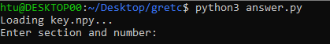
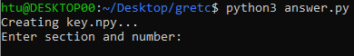
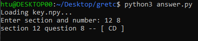
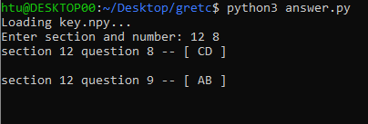
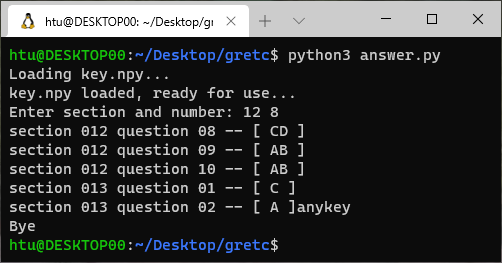

# gre TC

I don't want to see the answer for the next question when I am checking the answer. So this will show me the answer one by one.


## Files

- TCkey.txt 
    
    Downloaded answer from website. Unprocessed. To get the GRE TC answer I'm using, go to this [link](https://mp.weixin.qq.com/s/xaG6s4ETujJoaJpoJ7pcbw)

- key.npy

    Processed answer that is a numpy 2D array. First layer is section and second layer is question.

- answer.py

    Code to process TCkey.txt and get out answers.

## Usage

Run this in your terminal:

```
python3 answer.py
```

1. The code will automatically check if processed numpy array is available. If so, it will load it, else, it will process the raw text file.

    - key.npy exist
    
    

    - key.npy doesn't exist
    
    

2. Enter section # and question # seperated by a space when prompted. 

    ```
    e.g.  12 8
    ```
    

    For example, 'CD' is your answer.

3. Press Enter when you want to get the answer to the next question.

    

4. The program will automatically jump to next section when one section has been completed. 

    

5. Enter any other key to quit.

    

6. To go to another section, re-run the program.
