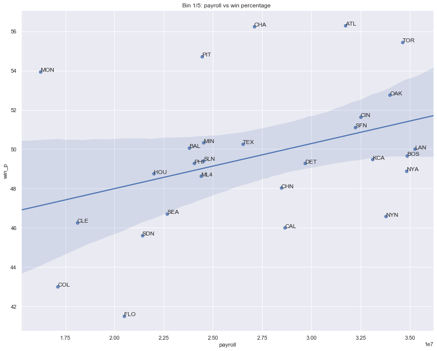
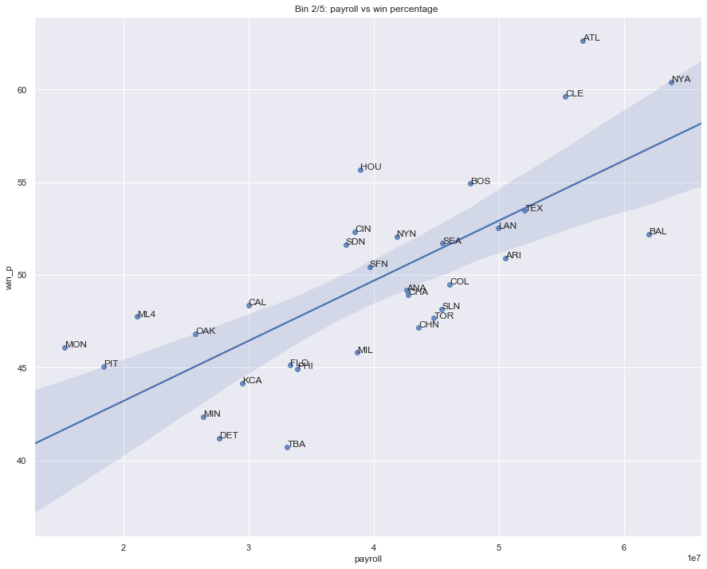
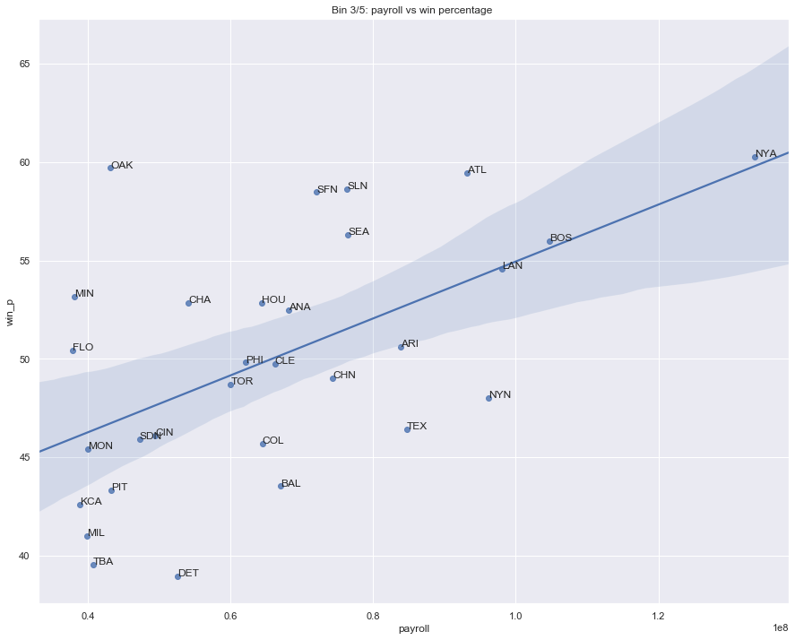
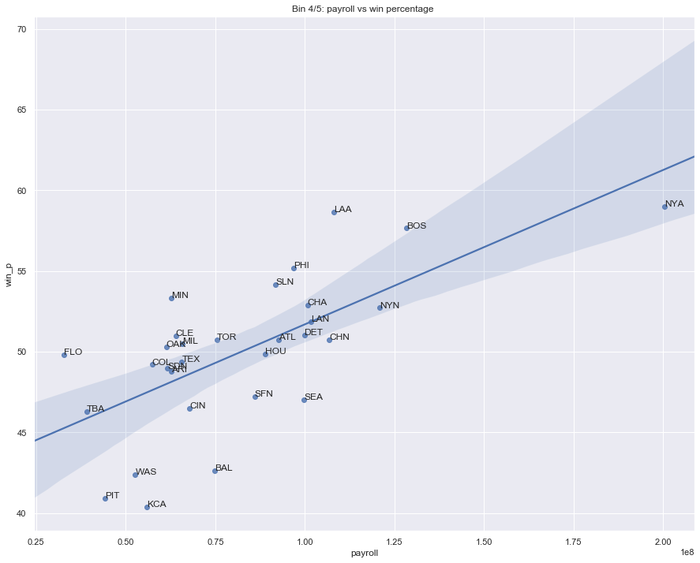
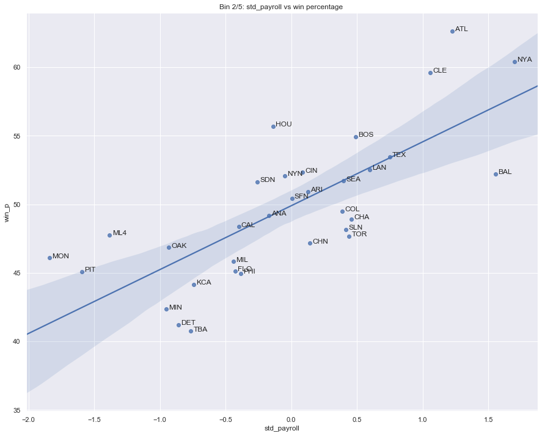
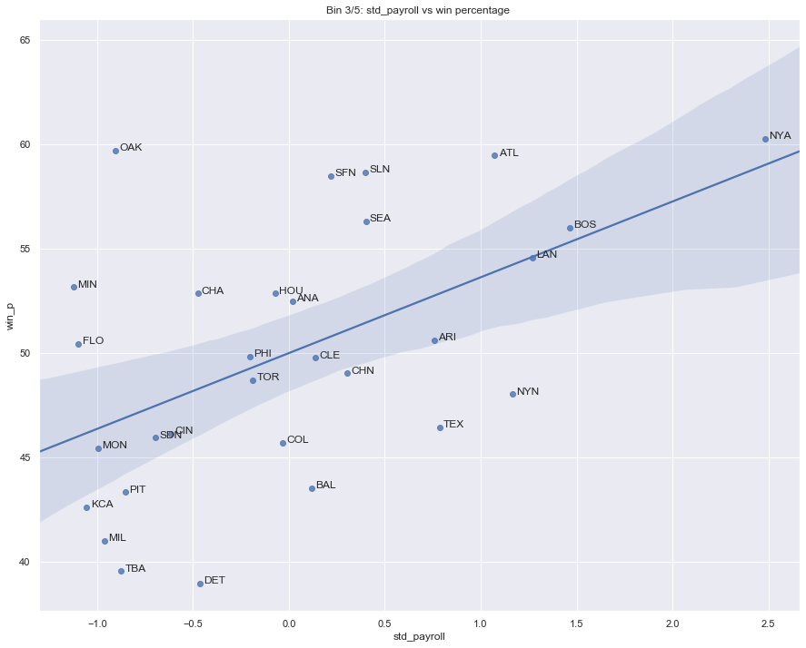
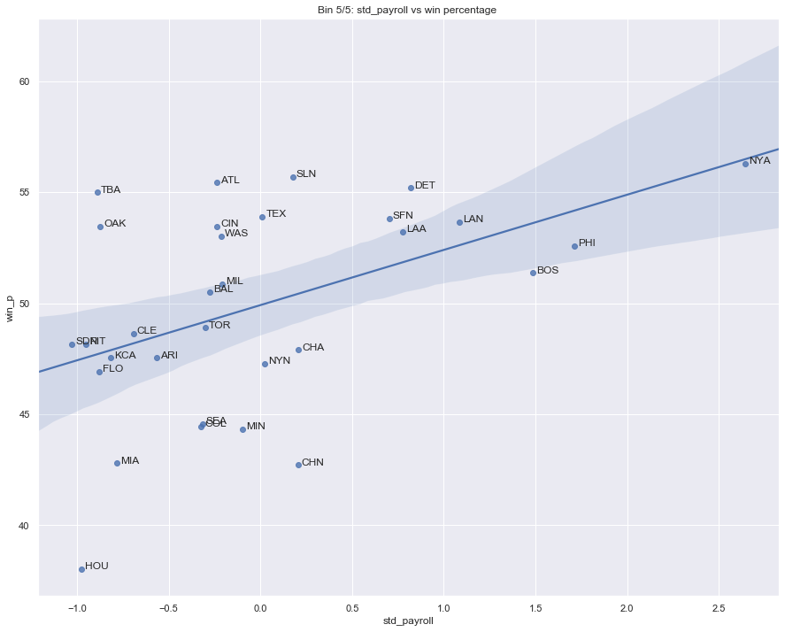
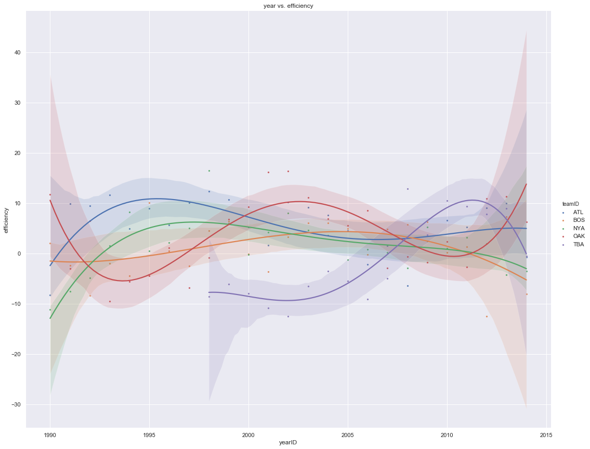

# Project 2: Wrangling and Exploratory Data Analysis

Hongyu Tu

Mar 20, 2020

## The Data


```python
import copy
import math
import sqlite3
import numpy as np
import pandas as pd
import seaborn as sns
from scipy import stats
import matplotlib.pyplot as plt
from numpy.polynomial.polynomial import polyfit
    
# make sure you write the path to your sqlite file here
con = sqlite3.connect(r'C:\\Users\\TomTu\\OneDrive - umd.edu\\2020 Spring\\CMSC 320\\project 2\\lahman2016.sqlite')
```

## Wrangling

#### Problem 1


```python
query = """
WITH tmp_Salaries AS (SELECT teamID, yearID, sum(salary) as payroll
             FROM Salaries
             WHERE yearID BETWEEN 1990 AND 2014
             GROUP BY teamID, yearID),
tmp_team AS (SELECT teamID, yearID, franchID, G, W, 1.0 * W / G * 100 AS win_p
         FROM teams
         WHERE yearID BETWEEN 1990 AND 2014)

SELECT DISTINCT tmp_team.*, tmp_Salaries.payroll
FROM tmp_Salaries
LEFT Join tmp_team 
on (tmp_team.teamID = tmp_Salaries.teamID and tmp_team.yearID = tmp_Salaries.yearID)
ORDER BY yearID ASC
"""

df = pd.read_sql_query(query, con)
df
```


<div>
<style scoped>
    .dataframe tbody tr th:only-of-type {
        vertical-align: middle;
    }

    .dataframe tbody tr th {
        vertical-align: top;
    }

    .dataframe thead th {
        text-align: right;
    }
</style>
<table border="1" class="dataframe">
  <thead>
    <tr style="text-align: right;">
      <th></th>
      <th>teamID</th>
      <th>yearID</th>
      <th>franchID</th>
      <th>G</th>
      <th>W</th>
      <th>win_p</th>
      <th>payroll</th>
    </tr>
  </thead>
  <tbody>
    <tr>
      <td>0</td>
      <td>ATL</td>
      <td>1990</td>
      <td>ATL</td>
      <td>162</td>
      <td>65</td>
      <td>40.123457</td>
      <td>14555501.0</td>
    </tr>
    <tr>
      <td>1</td>
      <td>BAL</td>
      <td>1990</td>
      <td>BAL</td>
      <td>161</td>
      <td>76</td>
      <td>47.204969</td>
      <td>9680084.0</td>
    </tr>
    <tr>
      <td>2</td>
      <td>BOS</td>
      <td>1990</td>
      <td>BOS</td>
      <td>162</td>
      <td>88</td>
      <td>54.320988</td>
      <td>20558333.0</td>
    </tr>
    <tr>
      <td>3</td>
      <td>CAL</td>
      <td>1990</td>
      <td>ANA</td>
      <td>162</td>
      <td>80</td>
      <td>49.382716</td>
      <td>21720000.0</td>
    </tr>
    <tr>
      <td>4</td>
      <td>CHA</td>
      <td>1990</td>
      <td>CHW</td>
      <td>162</td>
      <td>94</td>
      <td>58.024691</td>
      <td>9491500.0</td>
    </tr>
    <tr>
      <td>...</td>
      <td>...</td>
      <td>...</td>
      <td>...</td>
      <td>...</td>
      <td>...</td>
      <td>...</td>
      <td>...</td>
    </tr>
    <tr>
      <td>723</td>
      <td>SLN</td>
      <td>2014</td>
      <td>STL</td>
      <td>162</td>
      <td>90</td>
      <td>55.555556</td>
      <td>120693000.0</td>
    </tr>
    <tr>
      <td>724</td>
      <td>TBA</td>
      <td>2014</td>
      <td>TBD</td>
      <td>162</td>
      <td>77</td>
      <td>47.530864</td>
      <td>72689100.0</td>
    </tr>
    <tr>
      <td>725</td>
      <td>TEX</td>
      <td>2014</td>
      <td>TEX</td>
      <td>162</td>
      <td>67</td>
      <td>41.358025</td>
      <td>112255059.0</td>
    </tr>
    <tr>
      <td>726</td>
      <td>TOR</td>
      <td>2014</td>
      <td>TOR</td>
      <td>162</td>
      <td>83</td>
      <td>51.234568</td>
      <td>109920100.0</td>
    </tr>
    <tr>
      <td>727</td>
      <td>WAS</td>
      <td>2014</td>
      <td>WSN</td>
      <td>162</td>
      <td>96</td>
      <td>59.259259</td>
      <td>131983680.0</td>
    </tr>
  </tbody>
</table>
<p>728 rows × 7 columns</p>
</div>


## Exploratory data analysis

### Payroll distribution

#### Problem 2


```python
fig, ax = plt.subplots(figsize=(15,12))
sns.set(style="darkgrid")
sns.boxplot(x='yearID', y='payroll', data=df) 
plt.title('year vs payroll')
# plt.legend(bbox_to_anchor=(1.05, 1), loc=2, borderaxespad=0.)

# a = pd.concat({'x': df.yearID, 'y': df.payroll, 'val': df.teamID}, axis=1)
# for index, point in a.iterrows():
#     ax.text(point['x']+.02, point['y'], str(point['val']))

plt.show()
```


#### Question 1

There is a trend for payrolls to increase over time. And after 2015 there are teams that are paying a lot more than all other teams. 

#### Problem 3


```python
fig, ax = plt.subplots(figsize=(15,12))
mean = df.groupby('yearID')['payroll'].mean()
ave = pd.DataFrame({'year':mean.index, 'payroll':mean})
sns.regplot(x = "year", y = "payroll", data = ave)
plt.title('Average payroll of all teams from 1990 to 2014')
plt.show()
```


### Correlation between payroll and winning percentage

#### Problem 4


```python
df2 = copy.deepcopy(df)
df2['bin'] = pd.cut(df2.yearID, bins=5, labels=['0', '1', '2', '3', '4'])
mean_payroll = df2.groupby(['bin', 'teamID'])['payroll'].mean()
total_game = df2.groupby(['bin', 'teamID'])['G'].sum()
total_win = df2.groupby(['bin', 'teamID'])['W'].sum()
average_wp = total_win.divide(total_game)*100

df3 = pd.concat([mean_payroll, average_wp], axis=1).reset_index()
df3.columns = ['bin', 'teamID','payroll','win_p']

slope_all = []

for i in range(5):
    _,tmp = list(df3.groupby('bin'))[i]
    fig, ax = plt.subplots(figsize=(15,12))
    sns.set(style="darkgrid")
    sns.regplot(x = "payroll", y = "win_p", data = tmp)
#     sns.scatterplot(x = 'payroll', y = 'win_p', hue = 'teamID', data= tmp) 
#     plt.legend(bbox_to_anchor=(1.05, 1), loc=2, borderaxespad=0.)
    plt.title('Bin {}/5: payroll vs win percentage '.format(i+1))
    
    mask = ~np.isnan(tmp.payroll) & ~np.isnan(tmp.win_p)
    slope, intercept, r_value, p_value, std_err = stats.linregress(tmp.payroll[mask], tmp.win_p[mask])
    slope_all.append(slope)
    
    a = pd.concat({'x': tmp.payroll, 'y': tmp.win_p, 'val': tmp.teamID}, axis=1)
    for index, point in a.iterrows():
        if (not math.isnan(point['x'])) and (not math.isnan(point['y'])):
            # eff = "{:.2f}".format((point['y'] / point['x']) * (10 ** 6))
            # ax.text(point['x']+.02, point['y'], (str(point['val']) + ' ' + eff))
            ax.text(point['x']+.02, point['y'], str(point['val']))
            
    plt.show()

for i in range(5):
    print('slope for bin {} is {}'.format(i + 1, slope_all[i] * (10 ** 8)))
```














    slope for bin 1 is 22.927627783272996
    slope for bin 2 is 32.37862660567548
    slope for bin 3 is 14.458548013770484
    slope for bin 4 is 9.56621186186858
    slope for bin 5 is 6.142338031863316
    

#### Question 2

##### Q: What can you say about team payrolls across these periods?

A: From the slope of the regression line over the five periods, we can see that the effect of payroll on win percentage increased went from the first time period to the second one. But after that, the effect has been gradually decreasing, i.e. increase in payroll doesn't help boosting up win percentage as much as at it was nowadays when before. 

##### Q: Are there any teams that standout as being particularly good at paying for wins across these time periods? 

A: For the first time period, Atlanta Braves's payroll is around top ten but has the best win percentage. It continued to the second time period, although they are paying more than before as the third highest paying team in the league, their win percentage is still the highest, high above the linear regression prediction. Moving on to the third period, New York Yankees has the best win percentage with the cost of highest payroll, same for time period four and five. But during period four and five, there are teams achieving about the same win perccentage with much less payroll: for fourth period it's the Los Angeles Angels of Anaheim and Boston Red Sox, the fifth period it's the Atlanta Braves, Tampa Bay Rays, Detroit Tigers and St. Louis Cardinals. 

##### Q: What can you say about the Oakland Athlete’s spending efficiency across these time periods?

A: In the first time period Oakland Athletics had an fair spending efficiency that lying around average, although there are teams with less payroll that had better win percentage. Later in the second period their efficiency is still around average: not paying as much and not high in win percentage. In the third period they did a lot better than all other times, getting the second best winning percentage with little payroll. In fourth period they again came down to average. In the last time period, they had a fairly high win percentage as respect to their payroll, high above the average regression line.

## Data transformations

### Standardization across years

#### Problem 5


```python
avg_val = (df.groupby('yearID')['payroll'].mean()).to_dict()
std_val = (df.groupby('yearID')['payroll'].std()).to_dict()

std_pay = []

for index in range(len(df2)):
    year = df2.at[index, 'yearID']
    pay = df2.at[index, 'payroll']
    val = (pay - avg_val[year])/std_val[year]
    std_pay.append(val)

df5 = copy.deepcopy(df2)
df5['std_pay'] = std_pay

df5
```


<div>
<style scoped>
    .dataframe tbody tr th:only-of-type {
        vertical-align: middle;
    }

    .dataframe tbody tr th {
        vertical-align: top;
    }

    .dataframe thead th {
        text-align: right;
    }
</style>
<table border="1" class="dataframe">
  <thead>
    <tr style="text-align: right;">
      <th></th>
      <th>teamID</th>
      <th>yearID</th>
      <th>franchID</th>
      <th>G</th>
      <th>W</th>
      <th>win_p</th>
      <th>payroll</th>
      <th>bin</th>
      <th>std_pay</th>
    </tr>
  </thead>
  <tbody>
    <tr>
      <td>0</td>
      <td>ATL</td>
      <td>1990</td>
      <td>ATL</td>
      <td>162</td>
      <td>65</td>
      <td>40.123457</td>
      <td>14555501.0</td>
      <td>0</td>
      <td>-0.667275</td>
    </tr>
    <tr>
      <td>1</td>
      <td>BAL</td>
      <td>1990</td>
      <td>BAL</td>
      <td>161</td>
      <td>76</td>
      <td>47.204969</td>
      <td>9680084.0</td>
      <td>0</td>
      <td>-1.959861</td>
    </tr>
    <tr>
      <td>2</td>
      <td>BOS</td>
      <td>1990</td>
      <td>BOS</td>
      <td>162</td>
      <td>88</td>
      <td>54.320988</td>
      <td>20558333.0</td>
      <td>0</td>
      <td>0.924213</td>
    </tr>
    <tr>
      <td>3</td>
      <td>CAL</td>
      <td>1990</td>
      <td>ANA</td>
      <td>162</td>
      <td>80</td>
      <td>49.382716</td>
      <td>21720000.0</td>
      <td>0</td>
      <td>1.232198</td>
    </tr>
    <tr>
      <td>4</td>
      <td>CHA</td>
      <td>1990</td>
      <td>CHW</td>
      <td>162</td>
      <td>94</td>
      <td>58.024691</td>
      <td>9491500.0</td>
      <td>0</td>
      <td>-2.009859</td>
    </tr>
    <tr>
      <td>...</td>
      <td>...</td>
      <td>...</td>
      <td>...</td>
      <td>...</td>
      <td>...</td>
      <td>...</td>
      <td>...</td>
      <td>...</td>
      <td>...</td>
    </tr>
    <tr>
      <td>723</td>
      <td>SLN</td>
      <td>2014</td>
      <td>STL</td>
      <td>162</td>
      <td>90</td>
      <td>55.555556</td>
      <td>120693000.0</td>
      <td>4</td>
      <td>0.336014</td>
    </tr>
    <tr>
      <td>724</td>
      <td>TBA</td>
      <td>2014</td>
      <td>TBD</td>
      <td>162</td>
      <td>77</td>
      <td>47.530864</td>
      <td>72689100.0</td>
      <td>4</td>
      <td>-0.793346</td>
    </tr>
    <tr>
      <td>725</td>
      <td>TEX</td>
      <td>2014</td>
      <td>TEX</td>
      <td>162</td>
      <td>67</td>
      <td>41.358025</td>
      <td>112255059.0</td>
      <td>4</td>
      <td>0.137500</td>
    </tr>
    <tr>
      <td>726</td>
      <td>TOR</td>
      <td>2014</td>
      <td>TOR</td>
      <td>162</td>
      <td>83</td>
      <td>51.234568</td>
      <td>109920100.0</td>
      <td>4</td>
      <td>0.082566</td>
    </tr>
    <tr>
      <td>727</td>
      <td>WAS</td>
      <td>2014</td>
      <td>WSN</td>
      <td>162</td>
      <td>96</td>
      <td>59.259259</td>
      <td>131983680.0</td>
      <td>4</td>
      <td>0.601644</td>
    </tr>
  </tbody>
</table>
<p>728 rows × 9 columns</p>
</div>


#### Problem 6


```python
std_payroll = df5.groupby(['bin', 'teamID'])['std_pay'].mean()
df6 = pd.concat([std_payroll, average_wp], axis=1).reset_index()
df6.columns = ['bin', 'teamID','std_payroll','win_p']

new_slope = []

for i in range(5):
    _,tmp = list(df6.groupby('bin'))[i]
    fig, ax = plt.subplots(figsize=(15,12))
    sns.set(style="darkgrid")
    sns.regplot(x = "std_payroll", y = "win_p", data = tmp)
#     sns.scatterplot(x = 'payroll', y = 'win_p', hue = 'teamID', data= tmp) 
#     plt.legend(bbox_to_anchor=(1.05, 1), loc=2, borderaxespad=0.)
    plt.title('Bin {}/5: std_payroll vs win percentage '.format(i+1))
    
    mask = ~np.isnan(tmp.std_payroll) & ~np.isnan(tmp.win_p)
    slope, intercept, r_value, p_value, std_err = stats.linregress(tmp.std_payroll[mask], tmp.win_p[mask])
    new_slope.append(slope)
    
    a = pd.concat({'x': tmp.std_payroll, 'y': tmp.win_p, 'val': tmp.teamID}, axis=1)
    for index, point in a.iterrows():
        if (not math.isnan(point['x'])) and (not math.isnan(point['y'])):
            # eff = "{:.2f}".format((point['y'] / point['x']) * (10 ** 6))
            # ax.text(point['x']+.02, point['y'], (str(point['val']) + ' ' + eff))
            ax.text(point['x']+.02, point['y'], str(point['val']))
            
    plt.show()

for i in range(5):
    print('slope for bin {} is {}'.format(i + 1, new_slope[i]))
```











    slope for bin 1 is 1.662771916033947
    slope for bin 2 is 4.65760353105977
    slope for bin 3 is 3.6334676427943413
    slope for bin 4 is 3.2887285333585896
    slope for bin 5 is 2.485557578710465
    

#### Question 3

For data range, since the payroll was replaced with the standardized payroll, the range of the plot on x axis varied from around -2 to 3.5, and since there's no modification done on the win percentage , y axis didn't change at all. 

Distribution wise, I can see some changes in plot 1 and 2 where there are a lot more points landed on the regression line. Although for plot 3, 4, 5 it's not that obvious, but all five graphs seem to have the data getting closer to each other. Also from the slope of the regression line, we can see that after standardizing the payroll, the difference between the slope of the regression lines are smaller. 

### Expected wins

#### Problem 7


```python
fig, ax = plt.subplots(figsize=(15,12))
sns.set(style="darkgrid")
sns.regplot(x = "std_pay", y = "win_p", data = df5)
plt.title('winning percentage vs. standardized payroll')

# mask = ~np.isnan(df5.std_pay) & ~np.isnan(df5.win_p)
# slope, intercept, r_value, p_value, std_err = stats.linregress(df5.std_pay[mask], df5.win_p[mask])
# print('y = {0:.2f} x + {0:.2f}'.format(slope, intercept))
```

    y = 2.75 x + 2.75
    


#### Spending efficiency

#### Problem 8


```python
df5['expect_win_p'] = 2.5 * df5['std_pay'] + 50
df5['efficiency'] = df5['win_p'] - df5['expect_win_p']
keep = ['OAK', 'BOS', 'NYA', 'ATL', 'TBA']
df8 = df5.loc[df['teamID'].isin(keep)]

df8
```


<div>
<style scoped>
    .dataframe tbody tr th:only-of-type {
        vertical-align: middle;
    }

    .dataframe tbody tr th {
        vertical-align: top;
    }

    .dataframe thead th {
        text-align: right;
    }
</style>
<table border="1" class="dataframe">
  <thead>
    <tr style="text-align: right;">
      <th></th>
      <th>teamID</th>
      <th>yearID</th>
      <th>franchID</th>
      <th>G</th>
      <th>W</th>
      <th>win_p</th>
      <th>payroll</th>
      <th>bin</th>
      <th>std_pay</th>
      <th>expect_win_p</th>
      <th>efficiency</th>
    </tr>
  </thead>
  <tbody>
    <tr>
      <td>0</td>
      <td>ATL</td>
      <td>1990</td>
      <td>ATL</td>
      <td>162</td>
      <td>65</td>
      <td>40.123457</td>
      <td>14555501.0</td>
      <td>0</td>
      <td>-0.667275</td>
      <td>48.331811</td>
      <td>-8.208354</td>
    </tr>
    <tr>
      <td>2</td>
      <td>BOS</td>
      <td>1990</td>
      <td>BOS</td>
      <td>162</td>
      <td>88</td>
      <td>54.320988</td>
      <td>20558333.0</td>
      <td>0</td>
      <td>0.924213</td>
      <td>52.310533</td>
      <td>2.010454</td>
    </tr>
    <tr>
      <td>15</td>
      <td>NYA</td>
      <td>1990</td>
      <td>NYY</td>
      <td>162</td>
      <td>67</td>
      <td>41.358025</td>
      <td>20912318.0</td>
      <td>0</td>
      <td>1.018063</td>
      <td>52.545157</td>
      <td>-11.187132</td>
    </tr>
    <tr>
      <td>17</td>
      <td>OAK</td>
      <td>1990</td>
      <td>OAK</td>
      <td>162</td>
      <td>103</td>
      <td>63.580247</td>
      <td>19887501.0</td>
      <td>0</td>
      <td>0.746360</td>
      <td>51.865901</td>
      <td>11.714346</td>
    </tr>
    <tr>
      <td>26</td>
      <td>ATL</td>
      <td>1991</td>
      <td>ATL</td>
      <td>162</td>
      <td>94</td>
      <td>58.024691</td>
      <td>18403500.0</td>
      <td>0</td>
      <td>-0.750621</td>
      <td>48.123447</td>
      <td>9.901245</td>
    </tr>
    <tr>
      <td>...</td>
      <td>...</td>
      <td>...</td>
      <td>...</td>
      <td>...</td>
      <td>...</td>
      <td>...</td>
      <td>...</td>
      <td>...</td>
      <td>...</td>
      <td>...</td>
      <td>...</td>
    </tr>
    <tr>
      <td>699</td>
      <td>ATL</td>
      <td>2014</td>
      <td>ATL</td>
      <td>162</td>
      <td>79</td>
      <td>48.765432</td>
      <td>97609000.0</td>
      <td>4</td>
      <td>-0.207070</td>
      <td>49.482325</td>
      <td>-0.716893</td>
    </tr>
    <tr>
      <td>701</td>
      <td>BOS</td>
      <td>2014</td>
      <td>BOS</td>
      <td>162</td>
      <td>71</td>
      <td>43.827160</td>
      <td>139019929.0</td>
      <td>4</td>
      <td>0.767181</td>
      <td>51.917954</td>
      <td>-8.090793</td>
    </tr>
    <tr>
      <td>715</td>
      <td>NYA</td>
      <td>2014</td>
      <td>NYY</td>
      <td>162</td>
      <td>84</td>
      <td>51.851852</td>
      <td>197543907.0</td>
      <td>4</td>
      <td>2.144042</td>
      <td>55.360105</td>
      <td>-3.508253</td>
    </tr>
    <tr>
      <td>717</td>
      <td>OAK</td>
      <td>2014</td>
      <td>OAK</td>
      <td>162</td>
      <td>88</td>
      <td>54.320988</td>
      <td>72408400.0</td>
      <td>4</td>
      <td>-0.799950</td>
      <td>48.000125</td>
      <td>6.320863</td>
    </tr>
    <tr>
      <td>724</td>
      <td>TBA</td>
      <td>2014</td>
      <td>TBD</td>
      <td>162</td>
      <td>77</td>
      <td>47.530864</td>
      <td>72689100.0</td>
      <td>4</td>
      <td>-0.793346</td>
      <td>48.016634</td>
      <td>-0.485770</td>
    </tr>
  </tbody>
</table>
<p>117 rows × 11 columns</p>
</div>


```python
sns.set(style="darkgrid")
ax = sns.lmplot(x = 'yearID', y = 'efficiency', hue = 'teamID', data= df8, order = 4, truncate=True, height=12, aspect = 1.25, scatter_kws={"s": 5}) 
plt.title('year vs. efficiency')

ax
```


    <seaborn.axisgrid.FacetGrid at 0x1d1f52df988>





#### Question 4
From this graph we can see how for each team is doing with respect to the amount of money that they are paying for their players, given the correlation we found between the payroll and the expected win. We can see the curves fluctuating around the x axis (efficiency == 0), which gives us an average of zero. We can tell a team is doing great when their plot is above zero and vice versa. 

For Oakland, their plot is a 'W' shape, which agrees with my discovery in previous questions, they did great in 1st, 3rd and last time period, while doing not as good for the second and fourth time period. Moneyball period is between 2000 and 2005, which is exactly the third period. Oakland Athletes have their curve high above the x axis which means they won more games then they were expected given their payroll, i.e. they have high efficency. 


```python
con.close()
```
